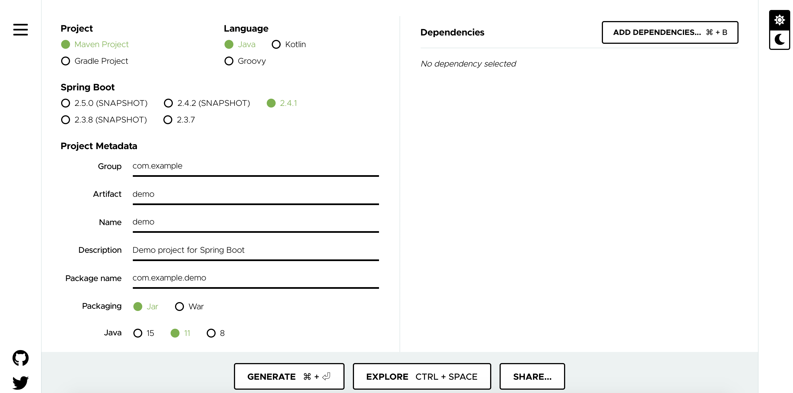
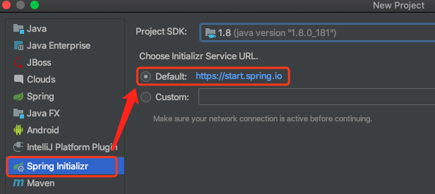
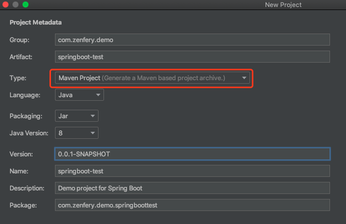

# 使用 Idea 快速创建 springboot 应用

创建 springboot 应用，可以采用以下方法：
- 创建一个 maven 项目，手动添加所需要的组件包。
- 使用 spring.io 官方提供的创建项目的工具页 `https://start.spring.io/`，如下图，页面可能会升级而导致与下图不符：

当然，spring.io 提供的工具页已经很方便了，还有一种日常更方便的方法：将 `start.spring.io` 集成到 idea 中。因为我们日常 Java 开发都是要在 IDE 中进行，Idea 又是使用率非常高一款 IDE。

## 如何使用 Idea 集成的 spring.io 进行开发

1. 使用 Idea 依次打开 File -> New -> Project... , 选择 Spring Initializr -> Default: https//start.spring.io , 点击 Next 。

2. 在 Porject Metadata 页，填入合适的选项即可：

3. 在 Dependencies 页选择必要的依赖组件，先选择 Springboot 版本，再选择组件。

4. 选择要保存的工程名称及目录，点击 Finish 即可，然后稍等片刻即可完成初始化。

5. 初始化完成后，打开工程目录，右键 pom.xm , 点击 "Add As Maven Projects"。

## 如果没有 Spring Initializr 选项
安装 `Spring Assistant` 插件即可。